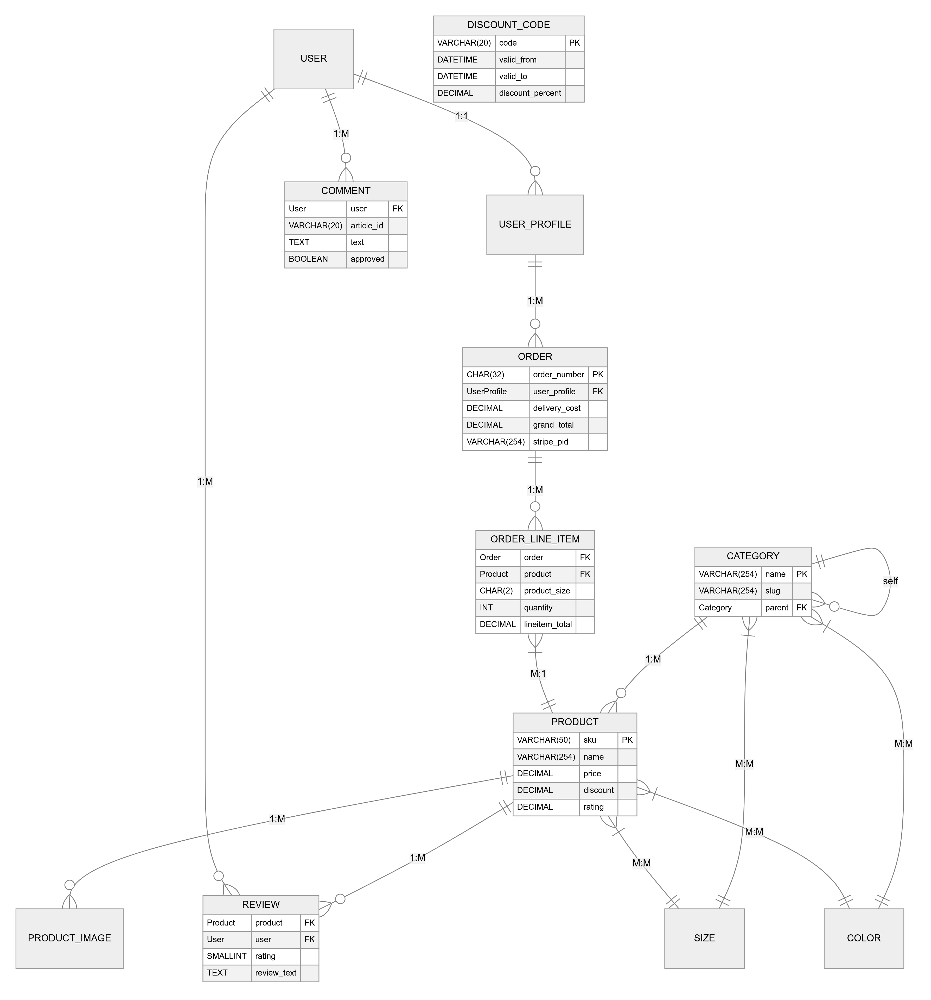

# Vogue Nest 🌟

**Redefining Fashion E-Commerce**  

## Table of Contents
- [Vogue Nest 🌟](#vogue-nest-)
  - [Table of Contents](#table-of-contents)
- [👗 About](#-about)
- [✨ Key Features](#-key-features)
- [🛠️ Tech Stack](#️-tech-stack)
- [🛢️ Database:](#️-database)
    - [Key Relationships:](#key-relationships)

# 👗 About

Vogue Nest is a cutting-edge fashion e-commerce platform that combines modern web technologies with AI-powered recommendations to deliver a personalized shopping experience. Designed for fashion enthusiasts who value both style and convenience, our platform offers:

- Curated collections from emerging designers
- AI-powered style matching
- Virtual try-on features (coming soon)
- Sustainable fashion marketplace

**Live Demo:** [https://vogue-nest-bb4c62d54744.herokuapp.com/]

# ✨ Key Features
  - ## 🛍️ Core Functionality
    - **Smart Product Catalog** with dynamic filtering
    - **User Authentication System** (Email & Social Login)
    - **Advanced Shopping Cart** with session persistence
    - **Secure Checkout** with Stripe integration
    - **Order Tracking & History**
    - **Product Reviews & Ratings**
    - **Wishlist Management**
    - **Admin Dashboard** with analytics

# 🛠️ Tech Stack
  - ## Backend
    - **Framework:** Django 3.2.25
    - **Database:** PostgreSQL
    - **Authentication:** Django Allauth
    - **Payments:** Stripe API

- ## Frontend
  - **CSS Framework:** Bootstrap 5.3
  - **JavaScript:** Vanilla JS + HTMX
  - **Templating:** Django Templates
  - **Icons:** Font Awesome 6
  - **Animations:** CSS3 + Animate.css

- ## Infrastructure
  - **Hosting:** AWS
  - **Storage:** AWS S3
  - **CI/CD:** GitHub Actions
  - **Wireframes:** Miro/ Figma
  - **mermaidchart:** Entry-Relationship Diagram Design (ERD)
  
# 🛢️ Database:
  

  ### Key Relationships:
  - User has one UserProfile (1:1)
  - User can have many Reviews and Comments (1:M)
  - UserProfile can have many Orders (1:M)
  - Order contains multiple OrderLineItems (1:M)
  - Product can appear in multiple OrderLineItems (1:M)
  - Product belongs to a Category (M:1)
  - Category can have sub-categories (self-referential)
  - Product has M:M relationships with Size and Color
  - Category defines available Sizes and Colors (M:M)
  - Product has multiple ProductImages (1:M)
  - Product can have multiple Reviews (1:M)